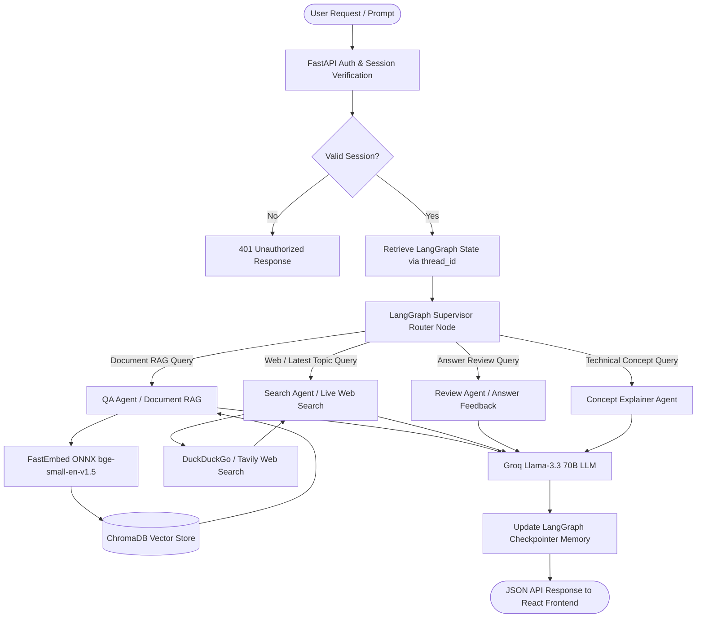

# DocMind AI - Multi-Agent RAG Interview Question & Preparation Platform

DocMind AI is an advanced, full-stack Retrieval-Augmented Generation (RAG) and multi-agent AI system built to empower job seekers, interviewers, and students. By combining custom document RAG, live web search, multi-agent orchestration via **LangGraph**, session-based thread memory, and modern UI analytics, DocMind AI delivers contextual interview preparation, concept explanations, and automated answer reviews.

---

## 🌟 Key Features

- **Multi-Agent Orchestration**: Powered by **LangGraph**, routing queries intelligently to specialized agent nodes based on intent.
- **Document-Based RAG**: Upload technical specs, study guides, or resumes (PDFs) to generate hyper-relevant interview questions anchored in source content.
- **Real-Time Web Search RAG**: Integrated web search tool (DuckDuckGo / Tavily) to pull the latest industry trends, new framework updates, and company-specific interview questions.
- **Stateful Thread Memory**: LangGraph `MemorySaver` checkpointer tied to user session IDs (`thread_id`), preserving multi-turn conversation history.
- **Interactive Answer Review & Evaluation**: Submit answers to generated questions and receive constructive feedback, scoring, and ideal reference answers.
- **Concept Deep-Dives**: Detailed technical breakdowns, analogies, and code examples for complex computer science topics.
- **Session-Based Authentication**: MongoDB Atlas backend user authentication with bcrypt password hashing and tokenized sessions.
- **Lightweight & Cloud Ready**: FastEmbed ONNX (`bge-small-en-v1.5`) embedding model designed for low-memory deployment (<512MB RAM on Render free tier).
- **Emerald Modern UI**: Monochromatic emerald/zinc theme built with React 19, Vite, Tailwind CSS v4, and Lucide React icons.

---

## 🛠️ Tech Stack

### Frontend
- **Framework**: React 19 + Vite
- **Routing**: React Router DOM (v7)
- **Styling**: Tailwind CSS v4 (Glassmorphism & Monochromatic Emerald Dark Mode)
- **Icons**: Lucide React (`lucide-react`)
- **State Management**: React Context API (`AuthContext.jsx`) + Local Storage token persistence

### Backend & AI Architecture
- **API Framework**: FastAPI (Python 3.11+, Async API handlers, CORS Middleware)
- **Multi-Agent Orchestration**: **LangGraph** (`StateGraph`, `MemorySaver`, `START`, `END`)
- **LLM Engine**: Groq API (`llama-3.3-70b-versatile` / `openai/gpt-oss-20b`)
- **Embeddings**: FastEmbed ONNX Runtime (`BAAI/bge-small-en-v1.5` - 384 dimensions)
- **Vector Database**: ChromaDB (Persisted local embeddings)
- **Database & Auth**: MongoDB Atlas + PyMongo + Bcrypt + UUID Session Management
- **Search Tool**: DuckDuckGo Search API / Tavily API

---

## 🤖 LangGraph Multi-Agent Architecture

DocMind AI utilizes a stateful **LangGraph Supervisor Graph** to manage dialog state and delegate user inputs to dedicated domain-specific agent nodes.

### Agent Nodes Breakdown

1. **Supervisor Router (`router.py`)**:
   - Analyzes incoming user messages and session context to determine intent.
   - Dynamically routes requests to `QA_Agent`, `Search_Agent`, `Review_Agent`, or `Explain_Agent`.
2. **Document RAG Agent (`QA_agent.py`)**:
   - Performs semantic similarity search against uploaded PDFs indexed in ChromaDB.
   - Generates contextual interview questions, key evaluation criteria, and model answers.
3. **Live Web Search Agent (`Search_agent.py`)**:
   - Triggers real-time web search for queries requiring current web knowledge or un-indexed topics.
   - Synthesizes web search results into structured interview preparation guides.
4. **Answer Review Agent (`review_agent.py`)**:
   - Compares candidate answers against generated questions and source material.
   - Provides rubric-based scoring, strength highlights, missed concepts, and refined sample answers.
5. **Concept Explainer Agent (`explain_agent.py`)**:
   - Serves as an interactive tutor breaking down complex algorithmic, system design, or domain concepts with code examples and analogies.

---

## 📊 LangGraph Workflow Diagram



---

## 🔐 Session-Based Authentication & Thread Memory

```
[React Frontend] 
   └── Sends X-Session-ID Header on /interview/generate
          │
          ▼
[FastAPI Backend] 
   └── Verifies session_id in MongoDB Atlas
          │
          ▼
[LangGraph Engine] 
   └── Configured with thread_id = session_id
          │
          ▼
[MemorySaver Checkpointer]
   └── Restores & persists message history per user session
```

- Each user login generates a unique `session_id` (UUID4) persisted in **MongoDB Atlas** and saved in `localStorage` on the frontend.
- When sending prompts, the frontend attaches `X-Session-ID` in request headers.
- FastAPI passes `config={"configurable": {"thread_id": session_id}}` to the LangGraph compiled graph.
- The `MemorySaver` checkpointer maintains conversation context across turns, enabling multi-turn follow-ups and feedback seamlessly.

---

## 🚀 Future Scope & Agent Roadmap

To evolve DocMind AI into an enterprise-grade AI technical career coach, the following features and agents are planned:

### 🔮 Future Agents to be Added

1. **`Mock_Interviewer_Agent` (Interactive Interview Simulator)**:
   - Conducts timed, conversational mock interviews in real-time.
   - Adapts difficulty based on candidate performance and asks progressive drill-down follow-up questions.
   - Supports voice input/output via WebRTC and speech-to-text.

2. **`Coding_Eval_Agent` (Code Execution & Complexity Evaluator)**:
   - Evaluates code snippets submitted by candidates in Python, JavaScript, Java, or C++.
   - Executes code in sandboxed environments (Docker/E2B) and analyzes time (`O(n)`) and space complexity.
   - Highlights edge cases, potential memory leaks, and anti-patterns.

3. **`Resume_Tailor_Agent` (ATS Resume Matcher & Optimizer)**:
   - Parses candidate resumes and matches them against target job descriptions (JD).
   - Generates skill gap analyses and custom question sets targeted specifically at resume weaknesses.

4. **`System_Design_Agent` (Architecture Whiteboarding Coach)**:
   - Interactive system design interviewer guiding candidates through building scalable distributed systems (e.g., URL Shortener, Chat System, Rate Limiter).
   - Evaluates trade-offs in database selection, caching strategies, load balancing, and data partitioning.

### 🌐 System & Infrastructure Enhancements

- **Cloud Vector Database (Qdrant / MongoDB Vector Search)**: Migrate from local ChromaDB to Qdrant Cloud or MongoDB Atlas Vector Search for multi-tenant isolation per user.
- **Export & Report Generation**: PDF/Markdown export for generated interview cheat sheets, review scorecards, and study plans.
- **Voice-Enabled Interviewing**: Integration with ElevenLabs / OpenAI Realtime API for natural spoken dialogue.

---

## 💻 Installation & Setup Guide

### Prerequisites
- Python 3.11+
- Node.js 18+ and npm
- MongoDB Atlas account (or local MongoDB server)
- Groq API Key

---

### Backend Setup

1. **Navigate to the backend directory**:
   ```bash
   cd backend
   ```

2. **Create and activate a virtual environment**:
   ```bash
   python -m venv venv
   # On Windows:
   venv\Scripts\activate
   # On macOS/Linux:
   source venv/bin/activate
   ```

3. **Install Python dependencies**:
   ```bash
   pip install -r requirements.txt
   ```

4. **Configure environment variables**:
   Create a `.env` file in the `backend/` directory:
   ```env
   GROQ_API_KEY=your_groq_api_key_here
   MONGO_URI=your_mongodb_atlas_connection_string
   DB_NAME=interview_ai
   ```

5. **Start the FastAPI server**:
   ```bash
   uvicorn app.main:app --reload --port 8000
   ```
   The backend API will be running at `http://localhost:8000`.

---

### Frontend Setup

1. **Navigate to the frontend directory**:
   ```bash
   cd frontend
   ```

2. **Install Node modules**:
   ```bash
   npm install
   ```

3. **Start the Vite development server**:
   ```bash
   npm run dev
   ```
   The application will be accessible at `http://localhost:5173`.

---

## 📁 Repository Structure

```
interview_question_generator/
├── backend/
│   ├── app/
│   │   ├── Agents/
│   │   │   ├── router.py          # Supervisor Router Node & LangGraph compilation
│   │   │   ├── QA_agent.py        # Document RAG Agent
│   │   │   ├── Search_agent.py    # Web Search RAG Agent
│   │   │   ├── review_agent.py    # Candidate Answer Review Agent
│   │   │   └── explain_agent.py   # Technical Concept Explainer Agent
│   │   ├── api/
│   │   │   ├── auth.py            # Signup, Login, Me Endpoints
│   │   │   ├── interview.py       # LangGraph Orchestration Endpoint
│   │   │   └── uploads.py         # PDF Ingestion & Chroma Vector DB Indexing
│   │   ├── config.py              # Configuration & Upload paths
│   │   └── main.py                # FastAPI App, CORS & Route Registrations
│   ├── chroma_db/                 # Local ChromaDB Vector Store
│   ├── uploads/                   # Uploaded PDF Storage
│   └── requirements.txt
├── frontend/
│   ├── src/
│   │   ├── components/
│   │   │   ├── AuthContext.jsx    # Session Authentication Context
│   │   │   ├── ChatArea.jsx       # Chat Message Container & Renderers
│   │   │   ├── Header.jsx         # Navigation & User Profile Header
│   │   │   ├── InputBar.jsx       # User Input Bar & File Upload
│   │   │   ├── Login.jsx          # Emerald Theme Login View
│   │   │   ├── Signup.jsx         # Emerald Theme Signup View
│   │   │   └── Sidebar.jsx        # History & Document Drawer
│   │   ├── api.js                 # Axios/Fetch API Client
│   │   ├── App.jsx                # React Router DOM Setup
│   │   └── index.css              # Tailwind CSS v4 & Styling Tokens
│   ├── package.json
│   └── vite.config.js
└── Readme.md                      # Project Documentation
```

---

## 📜 License

Distributed under the MIT License. See `LICENSE` for details.
